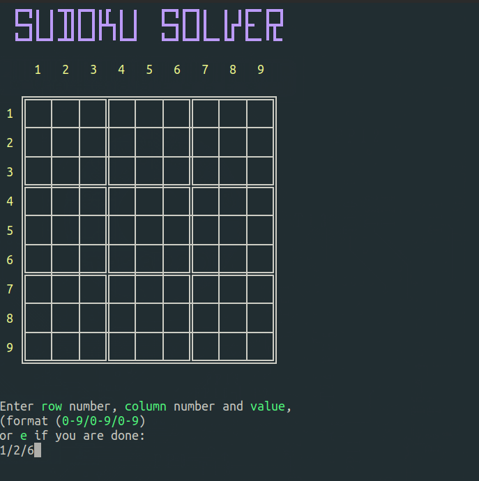
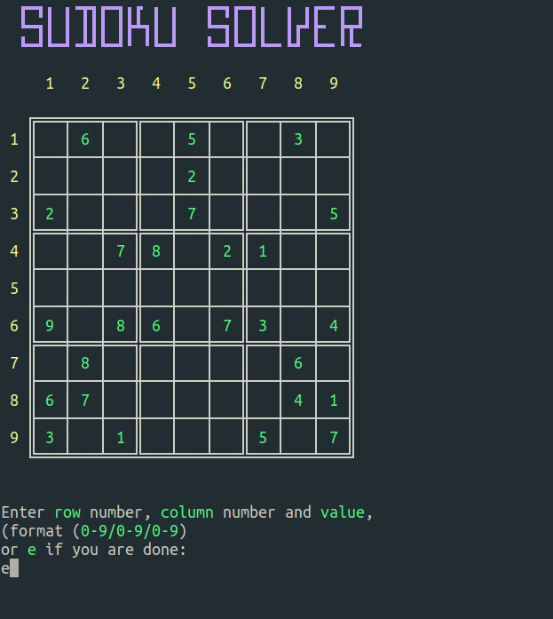

# SUDOKU SOLVER
A script in C language that can sove sudoku riddles.

## INSTRUCTIONS

* After you have downloaded and compiled the sudoku solver,

> gcc sudoku_solver.c -Wall -o sudoku_solver

 run the script:

>./sudoku-solver

* You will be prompted to enter the data of the sudoku riddle.

* Enter the data for each number, following the specific format(row number/column number/value), and press ENTER.

* The data will appear in the sudoku grid, in the specified "coordinates".

* Take care while you enter the data. You can erase  errors by entering value 0 to the coordinates you want to correct.

* Continue in this fashion until you fill in all the data, then enter the letter **e**.

* The sudoku solver will brute force its way to the solution:

Solving the sudoku riddle can take from  a fraction of  a second to a couple of minutes, depending on

* the difficulty of the riddle and 
* the CPU's calculating speed.
